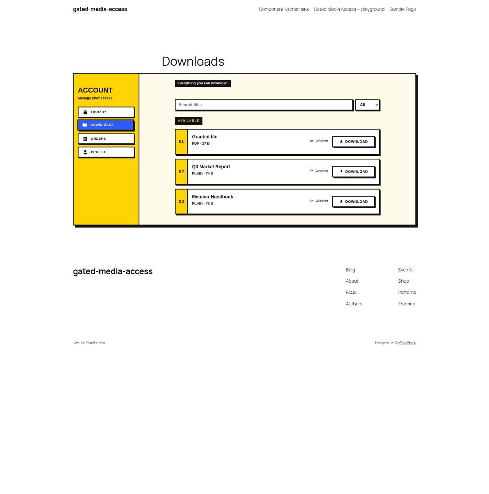
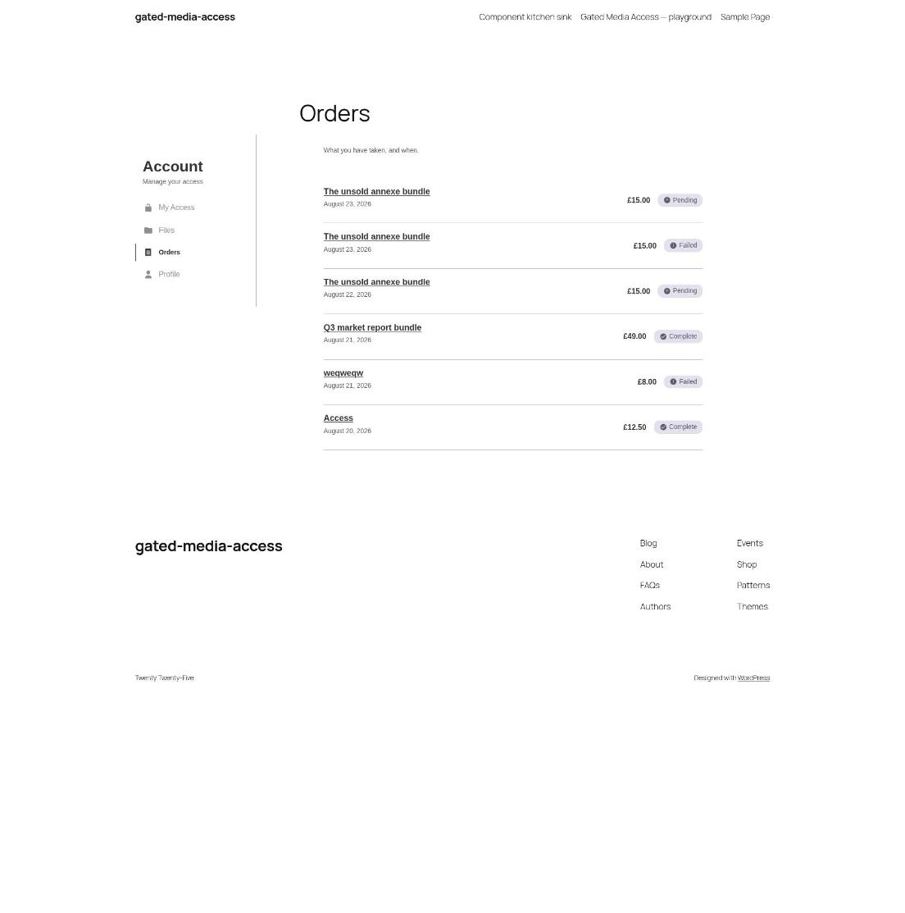
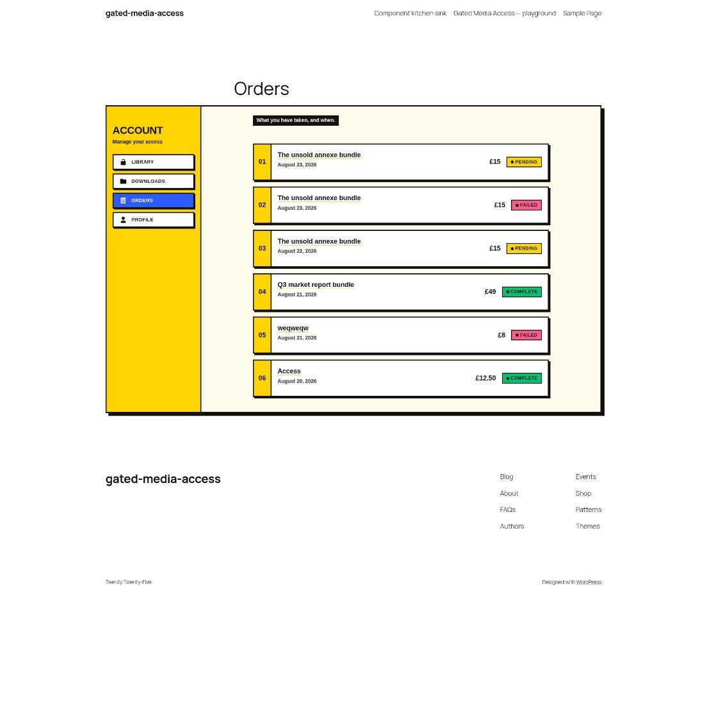

# Gated Media Access: Restyle

Restyles the [Gated Media Access](https://github.com/Pink-Crab/PinkCrab-Gated-Media-Access-Plugin) components from a separate plugin. Nothing in Gated Media Access is edited, and the theme is left alone.

It uses all three ways in: CSS, core's block filters, and Gated Media Access's own filters.

**[Try it in WordPress Playground](https://playground.wordpress.net/?blueprint-url=https://raw.githubusercontent.com/gin0115/gated-media-access-restyle/main/blueprint.json)**

## Before and after

| Before | After |
| --- | --- |
|  |  |
|  |  |
|  |  |
|  |  |

## What it changes

### CSS

Added to the `gatedmedia-front` handle with `wp_add_inline_style()`, which every Gated Media Access block already loads. It redefines the `--gatedmedia-*` custom properties and restyles the `.gatedmedia-*` classes: the account shell, nav, rows, buttons, pills, expiry, notices, empty state, fields and cards.

### Block filters

Every component is a server-rendered block, so core's block filters reach all of them.

| Filter | Change |
| --- | --- |
| `render_block_data` | An active status pill reads Live. Empty states use the info icon. |
| `render_block_gated-media-access/row` | A numbered tab on the front of every row. |
| `render_block_gated-media-access/status-pill` | The icon becomes a dot, and the pill gets a class per status for its colour. |
| `render_block_gated-media-access/button` | An arrow after the label of every primary button. |

### Gated Media Access filters

| Filter | Change |
| --- | --- |
| `gatedmedia_account_sections` | My Access is renamed Library, and Files is renamed Downloads. |
| `gatedmedia_my_access_data` | Groups, posts and files are listed by title. |
| `gatedmedia_format_price` | Whole amounts drop the zero pence: £15.00 shows as £15. |
| `gatedmedia_expiry_soon_days` | The expiry warning starts 14 days out rather than 7. |

Every hook Gated Media Access fires is documented in its [`docs/hooks.md`](https://github.com/Pink-Crab/PinkCrab-Gated-Media-Access-Plugin/blob/main/docs/hooks.md).

## Install

Needs Gated Media Access 0.1.0-RC1 or later and [restrict-media-file-access](https://github.com/a8cteam51/restrict-media-file-access), both active.

Copy `gated-media-access-restyle.php` into `wp-content/plugins/` and activate it.

## License

GPL-3.0-or-later.
